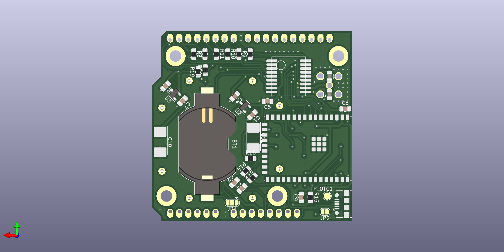

# RTK1010Board
Arduino Compatible RTK1010 Board/PCB

! Design not finished yet !

Feature:

* Arduino compatibe form factor
* RTK1010 GPS receiver
* optional SMA connector for external antennas
* IPEX connector for onboard antennas
* optional LDO for LNA power supply
* optional ESP32-S2 for operating as base station
* optional power via USB
* optional backup battery
* optional BNO055 IMU

Use Cases:

A.) Minimum RTK-1010 receiver with arduino form factor. 
* just RTK-1010 to RX/TX arduino pin
* SMA or IPEX connected
* LNA power

B.) Minimum USB powered RTK base station with RTK-1010, ESP32-S2.  
* RTK <=> TCP bridge

C.) Mowgli HEAD with RTK-1010, ESP32-S2 and BNO055 IMU (todo)
* running microROS
* VCC, GND, UART interface to YF mainboard
* low power, sleep mode

[Schematic](RTK1010Board.pdf)

