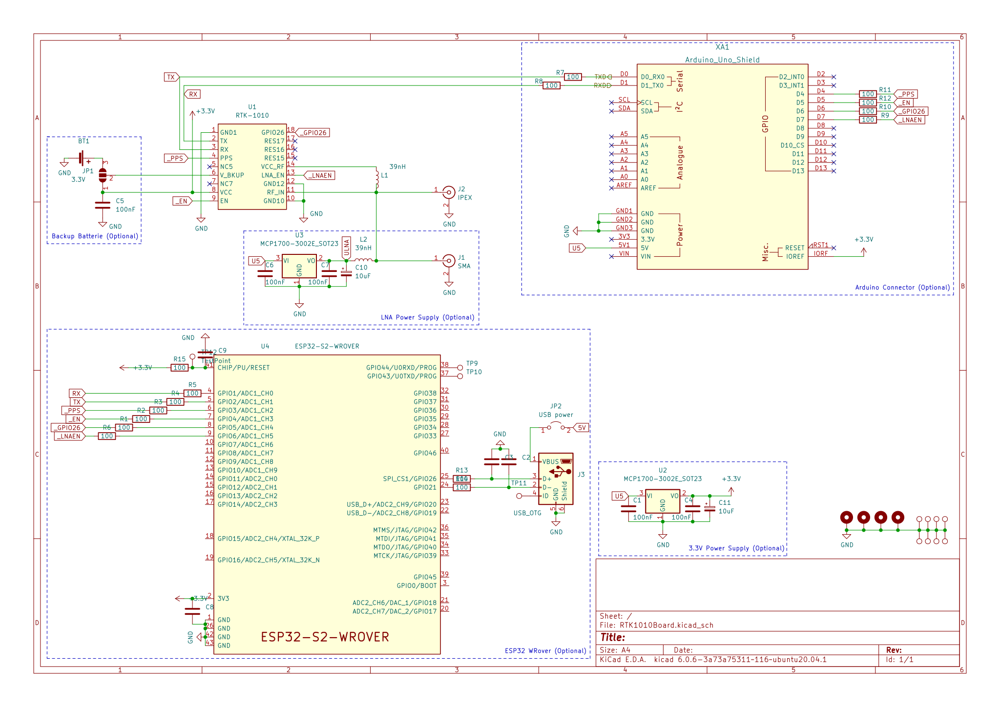

# RTK1010Board
Arduino Compatible RTK1010 Board/PCB

! Design not finished yet !

Feature:

* Arduino compatibe form factor
* RTK1010 GPS receiver
* optional SMA connector for external antennas
* IPEX connector for onboard antennas
* optional LDO for LNA power supply
* optional ESP32-S2 for operating as base station
* optional power via USB
* optional backup battery

